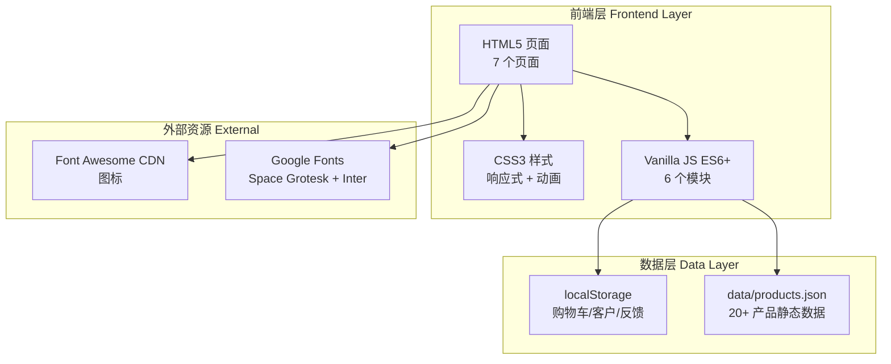

# Infomedia 电商平台 - 技术架构文档

## 1. 架构设计

本项目为纯前端静态网站，无后端服务，所有数据通过 localStorage 和 JSON 文件管理。



## 2. 技术栈说明

- **前端**：HTML5 + CSS3 + Vanilla JavaScript（ES6+）
- **构建工具**：无（纯静态文件，直接部署）
- **后端**：无（所有数据存于浏览器 localStorage）
- **数据库**：无（localStorage 替代）+ data/products.json 静态数据
- **图标**：Font Awesome 6 CDN
- **字体**：Google Fonts（Space Grotesk + Inter）

**用户明确要求不使用 React/Vue/Vite 等框架**，因此不使用 vite-init 模板，直接创建静态 HTML/CSS/JS 文件结构。

## 3. 路由定义

| 路由（文件） | 用途 |
|--------------|------|
| home.html | 首页：Hero + Banner 轮播 + 公司简介 + 特色卡片 + 精选产品 |
| products.html | 产品商店：分类筛选 + 产品网格 + Modal + Lightbox |
| cart.html | 购物车：商品列表 + 登录 + 订单汇总 + 下单 |
| admin.html | 后台管理：产品 CRUD + 客户注册 + 购物车管理 |
| about.html | 关于我们：公司故事 + 价值观 + 联系信息 |
| support.html | 支持：联系信息 + FAQ + 流程图 + 支持表单 |
| feedback.html | 客户反馈：评分表单 + 验证 + 反馈列表 |

## 4. 项目文件结构

```
441final/
├── index.html                  # 重定向到 home.html
├── home.html                   # 首页
├── products.html               # 产品商店
├── cart.html                   # 购物车
├── admin.html                  # 后台管理
├── about.html                  # 关于我们
├── support.html                # 支持
├── feedback.html               # 客户反馈
├── css/
│   └── style.css               # 全局样式（含响应式、组件样式）
├── js/
│   ├── main.js                 # 公共功能：Header/Footer 渲染、购物车角标、轮播、Toast
│   ├── products.js             # 产品商店：渲染、筛选、Modal、Lightbox
│   ├── cart.js                 # 购物车：渲染、加减、删除、订单计算、下单
│   ├── admin.js                # 后台：登录、产品 CRUD、客户注册、购物车管理
│   ├── storage.js              # 数据层：localStorage 封装（购物车/客户/反馈/产品）
│   └── validation.js           # 表单验证：邮箱、电话、必填、星级
├── data/
│   └── products.json           # 20+ 产品静态数据
└── .trae/
    └── documents/
        ├── PRD.md
        └── TechnicalArchitecture.md
```

## 5. JS 模块职责

### 5.1 storage.js（数据层核心）
封装所有 localStorage 操作，提供统一 API：
- `getCart() / saveCart(cart) / clearCart()` - 购物车
- `getProducts() / saveProducts() / addProduct() / updateProduct() / deleteProduct()` - 产品
- `getCustomers() / addCustomer()` - 客户
- `getFeedbacks() / addFeedback()` - 反馈
- `getLoginState() / setLoginState() / logout()` - 登录状态
- 使用 ES6 默认参数、展开运算符、箭头函数

### 5.2 main.js（公共模块）
- `renderHeader() / renderFooter()` - 通过 JS 动态注入，保证 7 页统一
- `updateCartBadge()` - 购物车数量角标实时更新
- `initBannerCarousel()` - 首页 Banner 自动轮播
- `showToast(message)` - 全局 Toast 通知组件
- `initMobileNav()` - 移动端汉堡菜单
- 所有页面通过 `<script src="js/main.js">` 引入并自动执行

### 5.3 products.js（产品商店）
- `loadProducts()` - 异步 fetch products.json（async/await）
- `renderProducts(category)` - 按分类渲染产品网格（模板字面量）
- `filterByCategory(category)` - 分类筛选
- `openProductModal(id)` - 打开产品详情 Modal
- `openLightbox(imageUrl)` - 全屏图片预览
- `addToCartFromModal(id)` - 从 Modal 加入购物车 + Toast

### 5.4 cart.js（购物车）
- `renderCart()` - 渲染购物车列表
- `changeQuantity(id, delta)` - 数量加减
- `removeFromCart(id)` - 删除商品
- `updateCart()` - 更新购物车
- `clearCartWithConfirm()` - 确认清空
- `loginCustomer()` - 客户登录验证
- `calculateOrder()` - 订单计算（小计/GST10%/运费/优惠券/总计）
- `applyCoupon()` - 应用 SAVE10 优惠券
- `placeOrder()` - 下单

### 5.5 admin.js（后台管理）
- `adminLogin()` - 管理员登录
- `renderAdminProducts()` - 渲染产品列表
- `addProduct()` - 添加产品
- `editProduct(id)` - 编辑产品弹窗
- `deleteProduct(id)` - 删除产品
- `viewAllCarts()` - 查看所有用户购物车
- `clearAllCarts()` - 清空所有购物车
- `registerCustomer()` - 客户注册

### 5.6 validation.js（表单验证）
- `validateEmail(email)` - 邮箱格式验证（正则）
- `validatePhone(phone)` - 电话格式验证
- `validateRequired(value)` - 必填验证
- `validateRating(rating)` - 星级验证（≥1）
- `showFieldError(fieldId, message)` - 字段错误提示
- `clearFieldError(fieldId)` - 清除错误

## 6. 数据模型

### 6.1 localStorage 数据结构

```javascript
// 购物车（key: 'infomedia_cart'）
[
  { "id": 1, "name": "Microcat EPC", "price": 299, "image": "...", "quantity": 2 }
]

// 产品（key: 'infomedia_products'，初始从 products.json 加载）
[
  { "id": 1, "name": "Microcat EPC", "price": 299, "category": "parts", "stock": 50, "image": "...", "description": "..." }
]

// 客户（key: 'infomedia_customers'）
[
  { "username": "...", "fullName": "...", "email": "...", "phone": "...", "password": "..." }
]

// 反馈（key: 'infomedia_feedbacks'）
[
  { "name": "...", "email": "...", "phone": "...", "rating": 5, "comment": "...", "date": "..." }
]

// 登录状态（key: 'infomedia_login'）
{ "isLoggedIn": true, "username": "admin", "role": "admin" }
```

### 6.2 产品分类映射

| 分类代码 | 显示名称 |
|----------|----------|
| parts | 零件目录 |
| ecommerce | 电商平台 |
| service | 服务管理 |
| analytics | 数据分析 |
| ai | AI |

## 7. 产品数据规划（20+ 个）

1. Microcat EPC - parts - $299/月 - 库存50
2. Microcat Pro - parts - $199/月 - 库存35
3. SimplePart - ecommerce - $499/月 - 库存20
4. Superservice Connect - service - $249/月 - 库存40
5. Superservice Menus - service - $149/月 - 库存25
6. Superservice Triage - service - $199/月 - 库存30
7. Infodrive - analytics - $399/月 - 库存15
8. Intellegam Assistants - ai - $299/月 - 库存10
9-20. 12 个变体产品（地区版/用户数版本），价格 $99-$599

## 8. 部署方案

- **本地预览**：直接用浏览器打开 home.html，或使用 VS Code Live Server
- **生产部署**：Netlify（拖拽部署或 Git 连接），无需构建步骤
- **无需构建工具**：纯静态文件，零依赖

## 9. ES6+ 特性使用计划

| 特性 | 使用位置 | 说明 |
|------|----------|------|
| let/const | 全部 JS 文件 | 替代 var |
| 箭头函数 | 全部 JS 文件 | 简化回调 |
| 模板字面量 | products.js, cart.js | HTML 模板生成 |
| 展开运算符 | storage.js | 数组合并/拷贝 |
| 默认参数 | storage.js, validation.js | 函数默认值 |
| 解构赋值 | cart.js | 对象属性提取 |
| async/await | products.js | fetch JSON |
| Promise | products.js | 异步加载 |
| Map/Set | 暂不使用 | - |
| 类（class） | 暂不使用 | 用函数式 |
